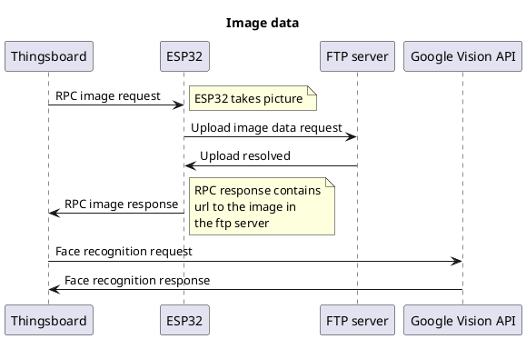

# Camera Controller Information

## Description

The camera controller is the code for the ESP32 AI THINKER with integrated camera module. It is in charge of, when triggered, capture a picture and reply to the RPC request with it. The objective of this device is to use the image data and process it with a facial and body recognition API so that some defense automations can activate.

This was though of due to the possibility of the car user not being available at the event of the theft. On the other hand we could not rely just on the movement sensor to trigger because it could be due to a false alarm. The solution we bring here is to have a middle man that can corroborate with certain accuracy the presence of a thief.

## Research, setbacks and final approach

* The original approach:
To receive the RPC request, take the picture, encode it with base64 and send it as a json string.

* The problem:
The string size was too big, the data was viewed as truncated and werent able to debug the issue with it.

* Second approach:
Make the API call from the ESP32 and send the result

* The problem:
Not enough memory space to make the api calls

* Third apporach:
Make an FTP server, upload the picture to it and send the image url instead.

## API connection

Originally the intention was to use the Face++ API. But due to problems with it (Only available to make a http post request with form-data body and not allowing urls like the one from the Ftp server) It was changed to the Google Vision API.

## Flow diagram




## Google Vision API

###  HTTP METHOD: POST

### URL: https://vision.googleapis.com/v1/images:annotate

### Query params: key

### Request body: 
```json
{
  "requests": [
    {
      "image": {
        "source": {
          "imageUri": "IMAGE_URL"
        }
       },
       "features": [
         {
           "type": "FACE_DETECTION"
         }
       ]
    }
  ]
}
```

### Response body:
```json
{
  "responses": [
    {
      "faceAnnotations": [
        {
          "boundingPoly": {
            "vertices": [
              {
                "x": 1077,
                "y": 157
              },
              {
                "x": 2146,
                "y": 157
              }
            ]
          },
          "fdBoundingPoly": {
            "vertices": [
              {
                "x": 1112,
                "y": 407
              },
              {
                "x": 1946,
                "y": 407
              }
            ]
          },
          "landmarks": [
            {
              "type": "LEFT_EYE",
              "position": {
                "x": 1368.748,
                "y": 739.0957,
                "z": 0.0024604797
              }
            },
            {
              "type": "RIGHT_EYE",
              "position": {
                "x": 1660.6105,
                "y": 751.5844,
                "z": -117.06496
              }
            },
            {
              "type": "LEFT_OF_LEFT_EYEBROW",
              "position": {
                "x": 1284.3208,
                "y": 666.61487,
                "z": 63.41506
              }
            }]
        }]
    }]
}
```