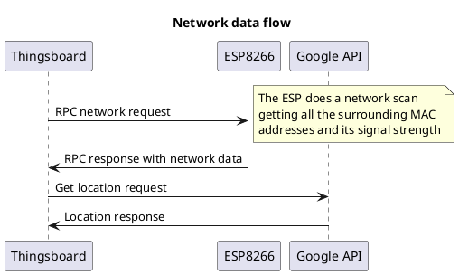

# Movement Controller Information

## Description

The movement controller is the code for the ESP8266 with a PIR sensor connected, its in charge periodically reading the movement data from the sensor and sending it as telemetry.
On top of that, the movement controller often receives RPC requests from Thingsboard to send a network scan information, which will be described more deeply next.

The purpose of it in the product is that, when detecting movement, sending an alarm trigger of movement and after that being in charge of triggering the camera RPC so that the later checks if there is a person inside to activate some automatic protections.

## Movement data

The movement data is a boolean value, which is read from the PIR sensor, the PIR sensor or (Passive infrared) reacts to sources of enery such as body heat from humans or animals. It is called passive because it doesn't emmit radiations, it instead receives them.

The data is sent through the telemetry topic which is then received on Thingsboard and it is used in an LED widget and it is processed on the rule chain for further rules to trigger.

## Network data flow

