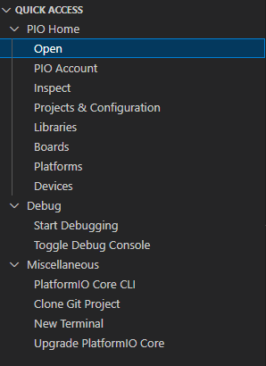
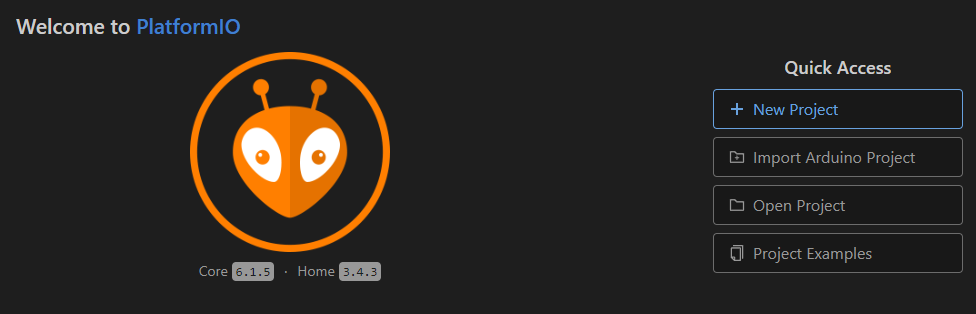
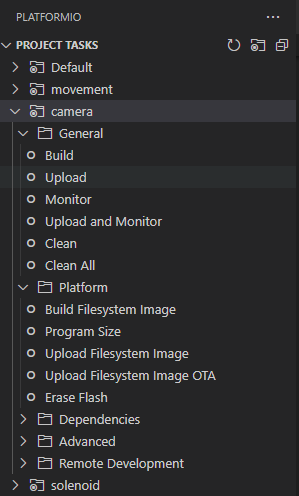

# Platformio getting started guide

## Description

Platformio is a VSCode extension that allows you to write microcontroller code and upload/ monitor it directly from VSCode.
It facilitates you on importing libraries, compilling, testing and structuring the project as well as having easy build and upload scripts.

## Set up steps

* Install platformio extension on VSCode
* Go to the platformio icon on the sidebar


* Click on PIO Home -> Open



* Click on New Project to create your new project



When completing the previous step, you will see a new workspace get initialized with various folders

## Structure

A Platformio project contains the following structure:

```
|--lib
|  |
|  |--Bar
|  |  |--docs
|  |  |--examples
|  |  |--src
|  |     |- Bar.c
|  |     |- Bar.h
|  |  |- library.json (optional, custom build options, etc)
|  |
|  |--Foo
|  |  |- Foo.c
|  |  |- Foo.h
|  |
|  |- README --> THIS FILE
|
|- platformio.ini
|--src
   |- main.c
```

It consists of:
* platformio.ini file, where the environments are set up (more on that later)
* test folder to include your tests
* src folder where all your .cpp files are located
* lib folder for project specific private libraries
* include folder for .h project specific files

Also, when building an environment, a .pio folder generates with the build

## Configure environments 

This can be done from the PIO Home project interface as well as from the platoformio.ini file

An environment was meant to provide different project phases to work with (test, development, production) but in our case was used to provide a monorepo structure with multiple deployment paths for different boards.

An environment structure looks like this

```ini
[env]
build_flags = 
	-D VERSION=1.2.3
	-D DEBUG=1
lib_deps_builtin = 
	SPI
	Wire
	
lib_deps_external = 
	bblanchon/ArduinoJson@6.19.4
	knolleary/PubSubClient@^2.8
```

It contains 
;   Build options: build flags, source filter
;   Upload options: custom upload port, speed and extra flags
;   Library options: dependencies, extra library storages
;   Advanced options: extra scripting

For our project it was essential to use build flags to filter out the other main.cpp files from the other boards.

[For more information on flags click here](https://docs.platformio.org/page/projectconf.html)

## Building/ uploading

Once you have your environments set up, go to the PIO icon on the sidebar and you will have different folders for project tasks for each environment.
When clicking on an environment a dropdown options menu will appear with all the commands for the desired action.

